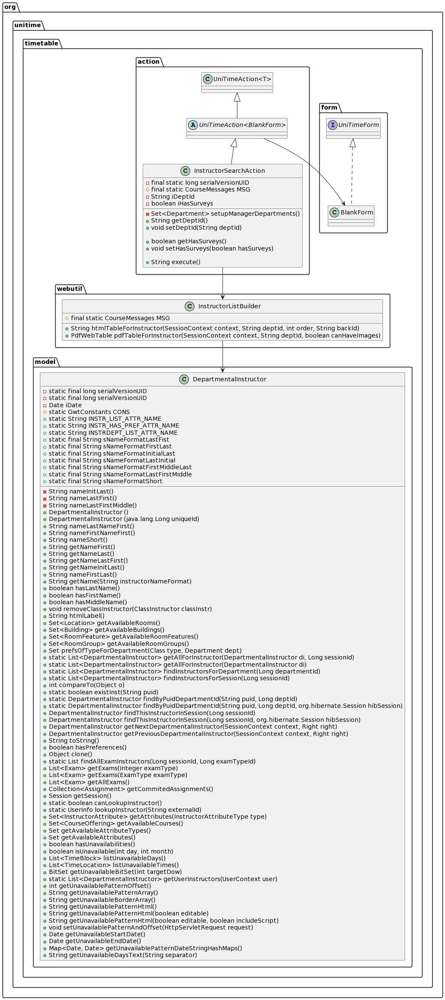
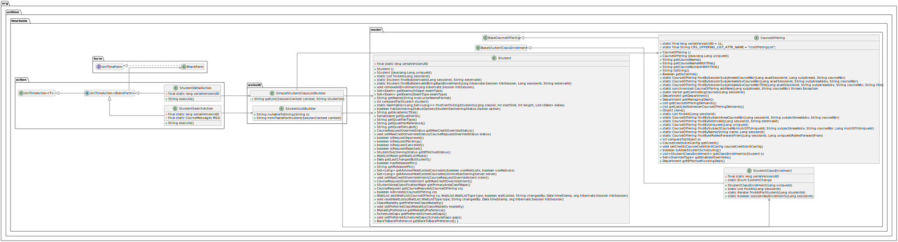

# Class diagram before implementing the changes

Our proposed change is the addition of a new feature that lets admins list all of the students
and their registered courses information.
We had to reverse-engineer the functionality of a similar feature in order to implement this feature.
That similar feature is the ability of admins to list all of the instructors and their details.
Figure 1 shows the class diagram of this feature

# Class diagram after implementing the changes

Figure 2 shows the classes that were added and used while adding our proposed feature.

