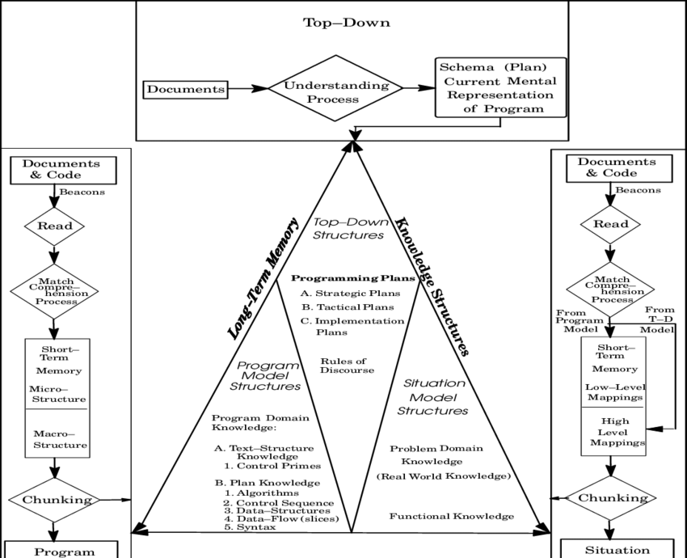

# Project Description

## What problems does the project solve

### Timetabling

- A university can have different lecture halls with different capabilities, capacities and purposes.
- It can also have students that are taking different combination of courses.
- Therefore, an intelligent solution is required so as to optimize the usage of halls and period times.

### Event Management

- A university can host more then just classes and lectures like Guest speakers, club meetings study sessions.
- UniTime handles the creation of class meetings and examinations in the events calender Automatically.
- Requesting and searching for events can be handled via the Web Interface that is available for all student and staff members.

### Examination Timetabling

- Builds a complete exam schedule.
- Minimizes number of conflicting exam placements for students.
- Limits the number of exams per day for students.
- Creates schedules for midterm and final exams

### Student Scheduling

- The student scheduling process matches the sets of classes required by each student to the available class spaces so that as many as possible of the students' educational requirements are met.
- UniTime can be used to construct a demand-based timetable and optimize the number of students who receive the needed courses.
- UniTime is able to determine the expected need for individual course sections through prior knowledge and information.

try to be consistent with the wording that I used above just to the point things we 5alas
all of this is the point lol
i can't do any less waw

## Techniques used to obtain information

We represent our understanding of the project using the integrated metamodel[^integrated-metamodel]
for program comprehension.

### Timetabling

- Establish a partial top-down model for the timetabling UniTime component using the
[provided documentation on the component](https://www.unitime.org/uct_courses.php).

- Refine the top-down model by running the application locally, logging in with a guest account,
and testing the !!TODO functionality

[^integrated-metamodel]:
    Mayrhauser, Anneliese & Vans, A. Marie. (1995).
    Program comprehension during software maintenance and evolution. Computer. 28. 44 - 55. 10.1109/2.402076.
